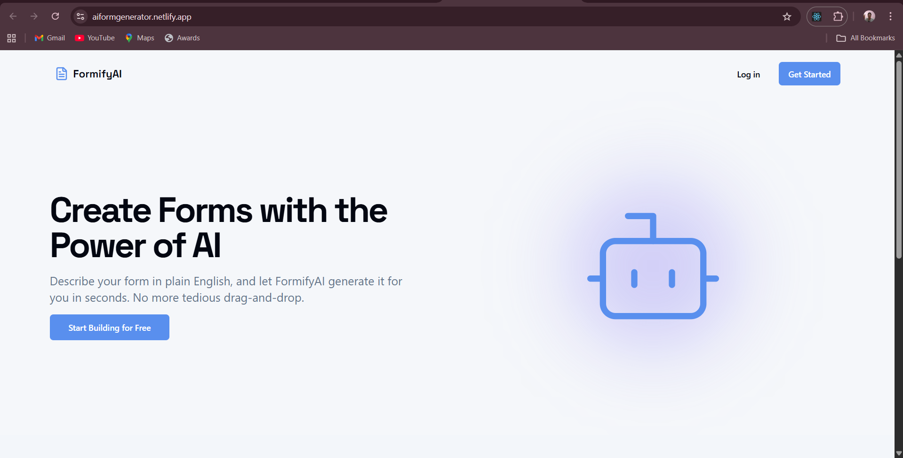
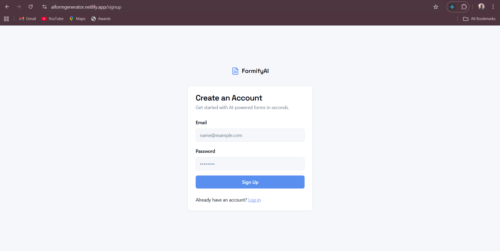
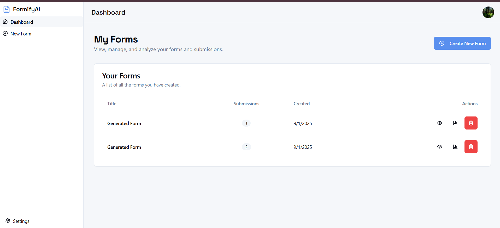
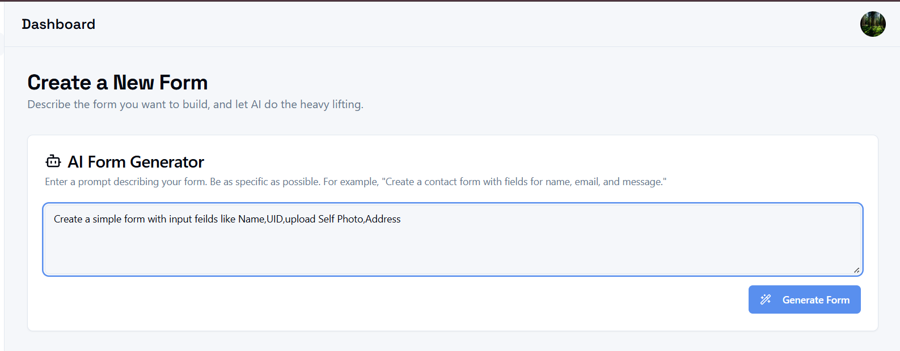
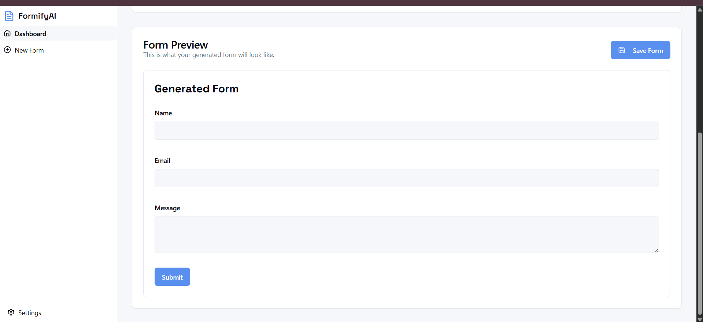
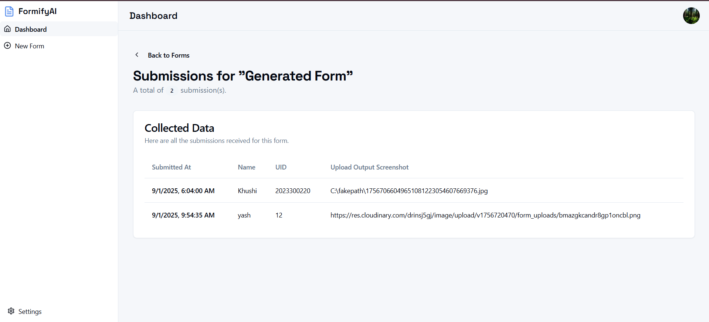
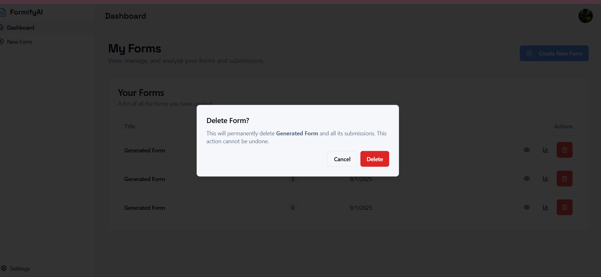

⚡ AI-Powered Dynamic Form Generator
An AI-powered dynamic form generator built with Next.js 15, MongoDB Atlas, and Google Gemini API.
This app allows users to generate custom forms from AI prompts, collect submissions (including file uploads), and manage data in real-time.

✨ Features

🤖 AI-Powered Form Generation
Generate form schemas instantly using Google Gemini API.

📝 Dynamic Form Rendering
Render any generated form dynamically with a clean UI.

👤 User Authentication
Secure signup/login with JWT authentication.

📂 File Uploads
Upload files (via Cloudinary) as part of form submissions.

📊 Dashboard
Manage your created forms and view collected submissions.

📱 Mobile Responsive 
Use the same web version seamlessly on mobile devices

🛠️ Tech Stack

⚡ Next.js 15 – Full-stack React framework (App Router + Server Components)

🌊 Tailwind CSS – Utility-first styling for responsive UI

🎨 ShadCN/UI – Prebuilt, accessible React components

🍃 MongoDB Atlas – NoSQL database for storing forms & submissions

🤖 Google Gemini API – AI-powered form schema generation

☁️ Cloudinary – File & image uploads with secure storage

🔐 JWT Authentication – Secure login & user sessions

🔧 TypeScript – Type safety & better developer experience

⚡ Setup Instructions:

1️⃣ Clone the Repository
git clone  https://github.com/Yash2004Codes/AI_Form_Generator_Web.git
cd ai-form-generator (after cloning )

2️⃣ Install Dependencies : npm install

3️⃣ Configure Environment Variables:
Create a .env.local file in project root directory and copy and fill these info
# MongoDB
MONGODB_URI=mongodb+srv://<username>:<password>@cluster.mongodb.net/formdb
MONGODB_DB=formdb
# Gemini API
GEMINI_API_KEY=your_gemini_api_key
# Cloudinary
CLOUDINARY_CLOUD_NAME=your_cloud_name
CLOUDINARY_API_KEY=your_cloudinary_key
CLOUDINARY_API_SECRET=your_cloudinary_secret

⚠️ Notes & Limitations:
Complex prompt might not generate the the expected forms.Simple prompts with clear mention of input feilds works best and form is generated fast.

🌱 Future Improvements:

✅ Add form sharing via links with access control(Currently form can be shared directly using browser session URL without and access control)

✅ Add form analytics dashboard (charts/graphs)

✅ Add email notifications on new submissions

✅ Add preview & drag-drop editor for forms

✅ Docker Integration for easy deployement on another PC(for devlopers oonly)

✅ Apache Kafka Integration for handling large amount of users concurrently

🎯 Working Demo

🔗 Web Version: 

# 📸 Screenshots

## 🏠 Home Page  

## 🔐 User Authentication  
  
For demo login use =>  
**Email:** yashjiakola@gmail.com  
**Password:** 12345678  
(You can create your own real account and login as well!)

## 📊 User Dashboard  

## ✍️ Form Creation  
  

## 📝 Submit Form  
  

## 📂 Display Collected Data  

## ❌ Delete Form  

## 📱 App Version: Completely Mobile Responsive  

👨‍💻 Developer Info

Name: Yash Lalit Sharma

💼 LinkedIn: linkedin.com/in/yash-lalit-sharma

💻 GitHub: github.com/Yash2004Codes

🌐 Portfolio: https://mryashlalitsharma.netlify.app/
